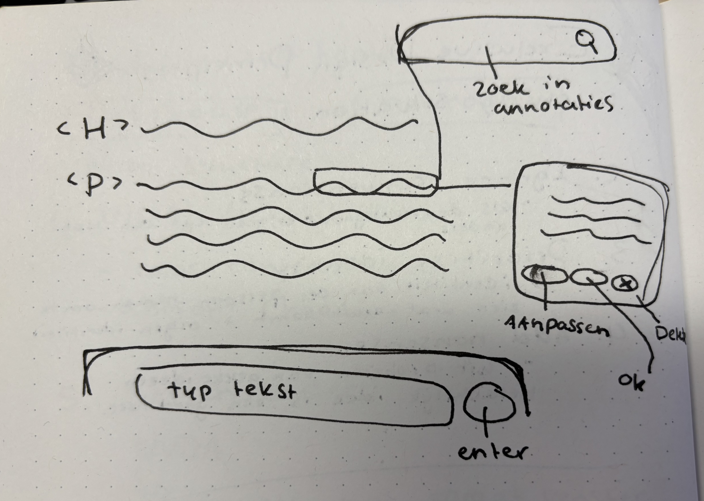
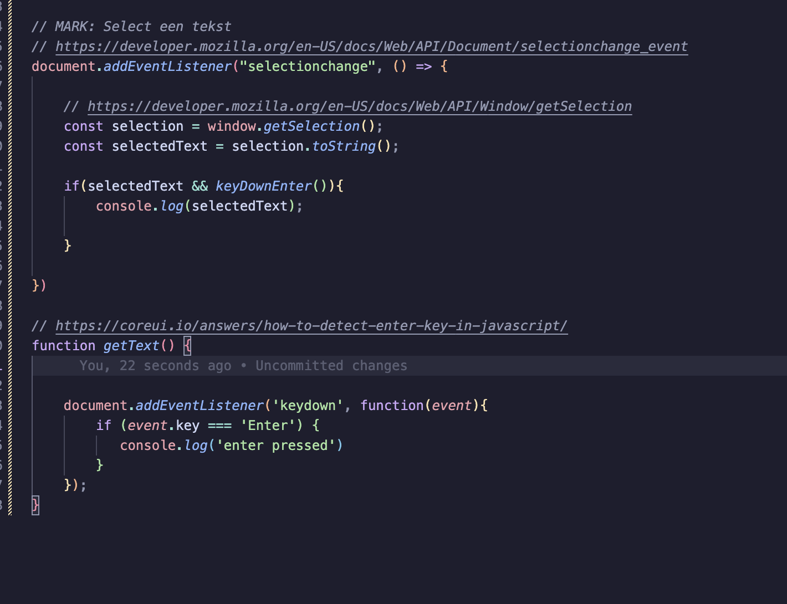
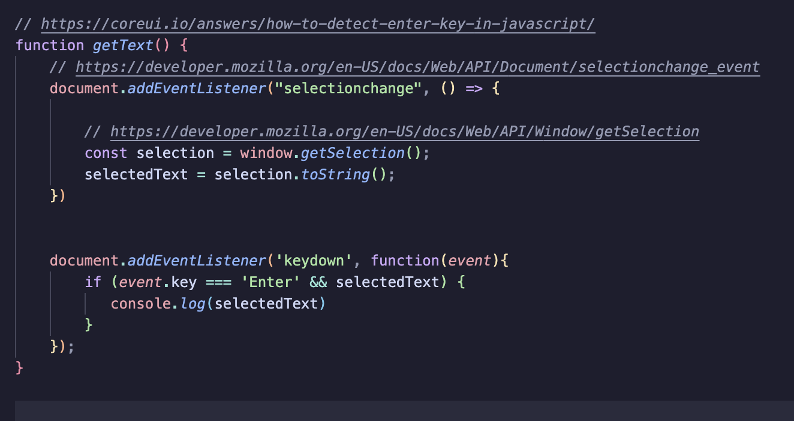
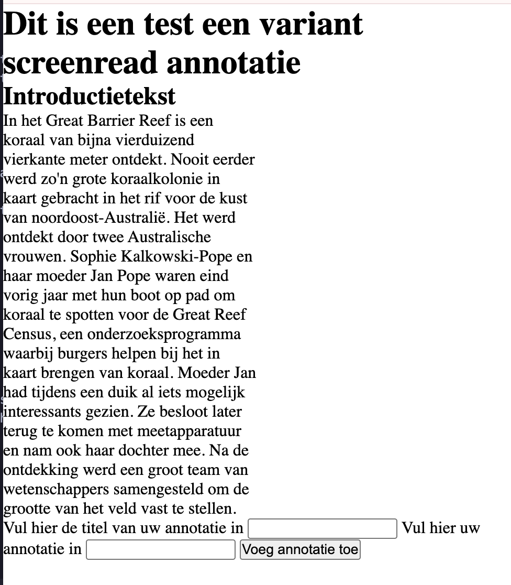
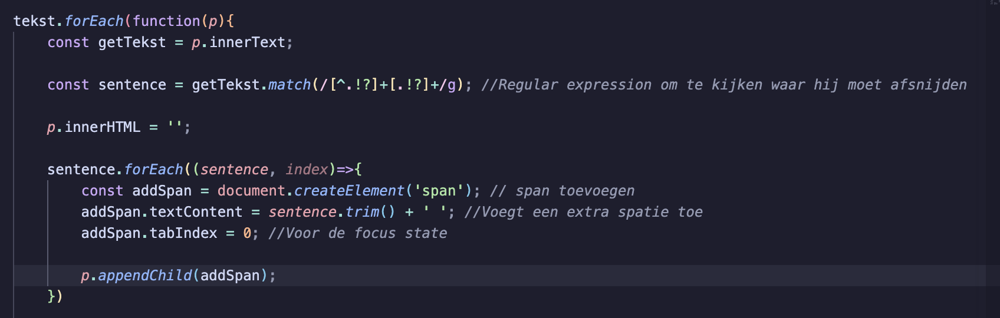
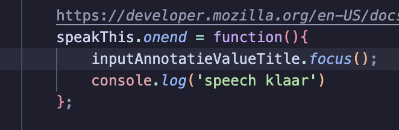

# Welkom bij het proces van HCD
School project van Sabrina vak HCD.

Ik heb het project van Roger.

**Opdracht:**
Roger studeert filosofie en hij wil graag annotaties kunnen maken in de (digitale) boeken die hij leest, en die annotaties makkelijk terug kunnen vinden.

Roger heeft maculadegeneratie. Hij kan steeds slechter zien en is nu op het punt dat hij echt niet meer zonder screen reader kan.

## Week 1: maandag 30 maart
### Proces
**Idee**
Een start met eerste schetsen maken voor een mogelijk idee, dit is alleen maar op aannames. 

Tekst die je kan uploaden? Die komt dan in het midde van het beeld te staan, onderin is een typ balk, zodat hij de annotaties kan typen en kan uploaden zodra hij met de screenreader iets geselecteerd heeft.

*Note to self: Hoe kan je iets selecteren met een screenreader?*

Je hebt en andere zoekbalk op het scherm waarin je kan zoeken door je annotaties, je kan binnen de annotaties heb je buttons met aanpassen, ok en delete om ook aan te kunnen passen. De annotaties moeten ook tab baas zijn.

*Note to self: Is was hij wilt een extensie of moet het een aparte applicatie zijn?*

Als het namelijk een aparte applicatie wordt, dan kan er een upload scherm vooraf aan toegevoegd worden, zodat hij zijn boeken via daar kan annoteren en dan aan het einde wellicht downloaden?? Anders is het mogelijk om het als een extensie toe te voegen aan een e-reader bijvoorbeeld.

*Note to self: Hoe kan je een screenreader stopzetten middenin een stuk tekst?*
Dit verschilt per screenreader, dus belangrijk om te vragen welk device Roger gebruikt en eventueel welke screenreader.

Hoe selecteerd Roger een stuk tekst, anders kan ik als hij iets geselecteerd heeft en dan op enter klikt dat dan de panel geopend wordt met de mogelijkheid om iets in te vullen. 

**Eerste stappen Code**
Als eerste wil ik kijken hoe ik iets moet selecteren en de data ervan kan loggen om te zien hoe het werkt, zodat het geselecteerde item daarna gebruikt kan worden om die selectie te onthouden.

De selected tekst werkte wel, alleen dan logt hij alles, dus ik wil voor nu dat hij op een trigger enter ook nog reageerd.

#### Testplan
##### Voorbereidende vragen voor Roger 
- Welke screenreader gebruikt hij?
- Kan hij nog een beetje zien is hij volledig blind?
- Waar liggen zijn interesses? Wat voor filosofische boeken leest hij?
- Via wat leest hij zijn boeken? 
- Is was hij wilt een extensie of moet het een aparte applicatie zijn? 

- Waar heeft hij baat bij met een screenreader?
- Welke browser gebruikt u? 

- Hoe gebruikt u de screenreader? Hoe selecteerd u een onderdeel uit een stuk tekst
- Kan u tekst selecteren met een screenreader?
- Wilt u annotaties bij woorden, zinnen of paragrafen maken?

##### Wat wil ik dat hij nu test?
- Ik wil kijken of hij iets in een stuk tekst kan selecteren, met de toetsenbord. 
- Hoe hij uberhaupt met een screenreader werkt.

### Voorbereiding weekly geek
Geschreven door Vasilis van Gemert 
- https://exclusive-design.vasilis.nl/
-https://exclusive-design.vasilis.nl/flipping-things/ 
1. Study situation: bestudeer de doelgroep 
2. Ignore conventions: Niet elke convention werkt vooe iedere doelgroep
Patterns we take for granted, like a navigation at the top of every page, make no sense to certain screen reader users.
3. Priotitise identity: design with people
or instance identity plays an important role as well. Identity is interesting. There’s brand identity, there’s the identity of the design team, but there’s also the identity of the people who use your website
4. Add nonsense: hoe kan je een functionele design naar een next level brengen
It says to consider the value of features and how they improve the experience for different users. It doesn’t seem to make any sense to not do this.
Adding nonsense to the mix can help in coming up with completely new ideas.

Why because we can

### Checkout
Vandaag gedaan met Matthew. 

#### Wat heb ik gedaan?
Ik heb nagedacht over waar ik mee ging starten en heb daar een start aan gemaakt, en ben daarbij ook begonnen met een nog wat algemene functie schrijven, omdat ik nog op veel vragen een antwoord moet krijgen om goed verder te kunnen, dus ik maak nu een prototype op basis van aannames als eerste iteratie.

#### Hoelang heeft dat geduurd?
- 09:30 - 10:30 Uitleg van de opdracht
- 10:30 - 12:30 Start gemaakt aan readme, vragen bedacht, javascript function geschreven.
- 12:30 - 13:30 pauze 
- 13:30 - 15:00 Verder werken en proberen toevoegen van een html article, kijken hoe het zit met de select en een toetsenbord.
- 15:00 - 16:00 weekly geek voorbereiden
- 16:00 checkout

#### Wat heb ik geleerd?
Ik heb geleerd dat er een select methode en een focus() is in javascript, dit kon handig zijn, maar het werkt niet zoals ik wilde.

#### Wat ga je morgen doen?
Verder kijken naar een andere mogelijkheid voor de select. Misschien proberen met een focus state op het element of er door javascript allemaal spannetjes eromheen te zetten kijken of dat werkt.
- Kijken of ik de focus state kan fixen
- testplan formuleren

### Iteratie 1: 0-meting
Ik heb op visueel vlak niet veel gedaan, ik ben gaan kijken naar de functionaliteit om te selecteren.

Alleen het selecteren gaat alleen met de muis, ik heb onderzocht of het mogelijk is om met een toetsenbord te doen alleen dat lukt niet. Dus ik wil kijken in hoeverre Roger al blind is en of hij met een muis werkt/wil werken. En anders ga ik kijken of ik dit nog anders kan doen en het per zin met spans ga doen. 

Of er is een manier waarop ik het anders kan doen, maar dat moet ik even nog in gaan duiken. Maar daarvoor is het handig voor mij als ik antwoord krijg op de vragen die ik hiervoor heb beschreven.

## Week 1: Dinsdag 31 maart
### Proces
Vandaag is de dag van de eerste test en ik wil eerst de situatie waarvoor ik iets moet maken beter begrijpen en begrijpen waar Roger meer behoefte aan heeft en wat al zijn mogelijkheden zijn.

Omdat ik gister niet kon vinden of je met een keyboard iets kan selecteren ben ik vandaag alvast bezig geweest om de teksten die ik heb daar een span van te maken.

Uiteindelijk heb ik het ook kunnen combineren met het eerder geschreven spraak bericht. En dat werkt, alleen werkt mijn focus state nog niet, ik wil namelijk dat als hij klaar is met voorlezen dat hij dan de focus zet op een eventuele input alleen dit werkt niet. Ik probeerde het eerst met een onend, alleen ik las dat dat niet werkt omdat het een async functie is.

Dus daar moet ik iets anders op bedenken. 

Ik ben vandaag bezig geweest met het maken van de functie om geselecteerde tekst nog een keer voor te lezen zodra je het selecteerd. Alleen toen ik het zelf ging testen met een screenreader en dan op enter klikte las hij het stuk nog een keer voor maar dan met een engels browser stem. Dat werkt niet helemaal lekker.

*Note to self: Stem aanpassen in browser + een oplossing vinden dat hij op een ander moment praat.*

*#### Study situation*
Wie is Roger en waar heeft hij behoefte aan? 
Hoe kan hij notities terug vinden. Aantekeningen maken bij het studeren. Moeite met aantekeningen terug te vinden bij de boeken.

#### Testplan
##### antwoorden van Roger 
- Welke screenreader gebruikt hij?
Ingebouwde op mobiel Iphone. Gewoon super nova, nvde nova op zijn laptop. Want hij heeft geen macbook.

- Kan hij nog een beetje zien is hij volledig blind?
Hij ziet wel kleuren, maar wordt steeds verder aangetast. Omdat de kegeltjes steeds verder weg gaan. Contrast en lichtgevoeligheid. Van licht naar donker en visa versa moeite. Hij keert alles om heeft zijn telefoon in darkmode staan.

Hij ziet zogezegd als je je vuist voor je gezicht houdt.

Het is een grote blur. 

Wel een woord, maar niet een hele zin.

- Waar liggen zijn interesses? Wat voor filosofische boeken leest hij?
Filosofische boeken. Misschien heeft hij nog wat dingen.        

- Via wat leest hij zijn boeken? 
Luisterboeken gebruikt hij. Tot zich nemen met spraak. 
Aantekeningen zoals word, maar dat werkt ook niet optimaal.

dedicom loket waar hij zijn boeken koopt in edutekst

Het is lastig om boeken in word te krijgen. Filosofische boeken zijn moeilijker te krijgen.

- Is was hij wilt een extensie of moet het een aparte applicatie zijn? 
een tool waar hij aantekeningen kan maken en terug kan vinden. Waar je eventueel aan 

- Welke browser gebruikt u? Welk device?
Beide onderweg veel op de telefoon, maar dan kan hij geen aantekeningen maken.  Maar is wel behoefte naar, maar hij weet niet hoe.

Maar leren op de computer, om makkelijker aantekeningen te maken.
Blind typen lukt ook wel voor 80%.

- Hoe gebruikt u de screenreader? Hoe selecteerd u een onderdeel uit een stuk tekst?

- Kan u tekst selecteren met een screenreader?

- Wilt u annotaties bij woorden, zinnen of paragrafen maken?
Hij maakt nu per bladzijde aantekeningen, maar hij is nog zoekende in wat voor hem het beste werkt.

- Hoe maakt hij aantekeningen?
Hij neemt het soms op, en maakt wel soms aantekeningen. Met word kan je aantekeningen maken, maar het terugvinden is lastig. Het moet handiger kunnen. 

Voorkeur: whatsapp gebruikt hij vaak auditief, is wel fijn en heeft een voorkeur. En met stotteren wordt het wel iets lastigers. 
Hij typt wel liever. Maar beide opties zijn interessant.

- Wat wilt u niet zien?
Dat het zegt dat het toegankelijk is, maar dat het niet is. Niet iedereen heeft skills op een hoog lever, net als braille.

- Lastig vindt
Wil nog liever iets? in word dan alleen maar een website. Kan wel voorlezen dat kan wel goed werken, maar op studie gebied, dan moet je kunnen kopieren en in een ander bestandje.

Spraak kan soms ook wel storend zijn. 

Plaatjes kunnen omzetten in tekst. 

- Indeling van concepten?
Liefst per boek aantekeningen kunnen maken.
Nu per bladzijde, een ordening. Koppenstructuur wel fijn.

##### Opmerking tijdens een aantal tests
- Niet een tab om terug te gaan
- Liefst inladen document
- Grotere letters
- Accent color is vervelend, maar helpt wel
- Navigatie binnen de tekst moet beter.

- Vooraf controls voorlezen, hij is het nog niet over uit welke zijn voorkeur heeft.
- Hoe kan hij opmerkingen vinden. 
- Zwart op geel is een prettige manier voor het contrast.

### Weekly geek bespreken
Gedaan met wooclap.

### Checkout
#### Wat heb ik gedaan?
Ik heb een function geschreven voor de span, zodat je kan tabben door de verschillende zinnen heen en dan kan hij deze voorlezen.

#### Hoelang heeft dat geduurd?
- 09:30 - 10:00 weekly geek
- 10:00 - 12:30 verder werken, functie geschreven voor de spannetjes
- 12:30 - 14:00 pauze 
- 14:00 -16:00 Gesprek met Roger.

#### Wat heb ik geleerd?
Ik ben weer een stapje verder gekomen met javascript, met het begrijpen en verschillende functionaliteiten toegepast zoals match() en trim()

#### Wat ga je morgen doen?
Op basis van de iteratie ga ik verder met maken. 
- Achtergrond kleuren en kleuren aanpassen
- Als je op Enter klikt dat je dan kan typen
- Bestand upload maken
- Notitie maken werkend
- Zoeken in notities

### Iteratie 2: Plannen na eerste gesprek
[]Achtergrond kleuren en kleuren aanpassen
[]Als je op Enter klikt dat je dan kan typen
[]Bestand upload maken
[]Notitie maken werkend
[]Zoeken in notities
[]Localhost fixen zodat het opslaat on refresh

#### Iteratie

## Week 2: Maandag .. april
### Proces
De maandag is een vrije dag, maar ik ben na afgelopen dinsdag nog bezig geweest.

Nu werkt mijn focus() ineens wel. Hoe ik heb geen idee, maar hij doet het nu. Het kan liggen omdat ik de functie uit een andere functie heb gehaald, maar geen idee.

*#### Study situation*
Wie is Roger en waar heeft hij behoefte aan? 

#### Testplan
##### Voorbereidende vragen voor Roger 

#### Iteratie
##### Wat ik meeneem uit de test:

### Weekly geek bespreken

### Checkout
#### Wat heb ik gedaan?
#### Hoelang heeft dat geduurd?
#### Wat heb ik geleerd?
#### Wat ga je morgen doen?

### Iteratie 2: Wat ik nu heb

## Week 2: Dinsdag ... april
### Proces
Vandaag is de dag van de

*#### Study situation*
Wie is Roger en waar heeft hij behoefte aan? 

#### Testplan
##### Voorbereidende vragen voor Roger 

#### Iteratie
##### Wat ik meeneem uit de test:

### Weekly geek bespreken

### Checkout
#### Wat heb ik gedaan?
#### Hoelang heeft dat geduurd?
#### Wat heb ik geleerd?
#### Wat ga je morgen doen?

### Iteratie 2: Na eerste gesprek

## Bronnen
### content
Voor test 1:
-  Als placeholder een stuk uit artikel: https://nos.nl/artikel/2603972-australische-moeder-en-dochter-ontdekken-koraalkolonie-een-weiland-van-koraal

### Javascript
#### Function geselecteerde tekst
- Function geoptimaliseerd met chatgpt: Prompt: Ik wil dat als je geselecteerd heb en dan op enter klikt dat je dan een consol log hebt met de tekst maar dit werkt niet, wat doe ik fout?
https://chatgpt.com/share/69ca4ec3-b6b8-8333-b600-b28db00df488
- https://coreui.io/answers/how-to-detect-enter-key-in-javascript/
- https://developer.mozilla.org/en-US/docs/Web/API/Document/selectionchange_event 
- https://developer.mozilla.org/en-US/docs/Web/API/Window/getSelection 

Dat hij het geselecteerde voorleest:
- https://developer.mozilla.org/en-US/docs/Web/API/SpeechSynthesisUtterance 
- https://developer.mozilla.org/en-US/docs/Web/API/SpeechRecognition/end_event

Het opsplitsen van zinnen met span: 
 - https://developer.mozilla.org/en-US/docs/Web/JavaScript/Reference/Global_Objects/String/trim
 - https://developer.mozilla.org/en-US/docs/Web/JavaScript/Reference/Global_Objects/String/match

/**
 * Hulp bron: chatgpt
 * Prompt: ik wil eigenlijk van de tekst wat in mijn html staat per zin een span maken, en zodra de focus op de span is en er op enter geklikt wordt dat hij dat dan ziet als een selection
 * Link: https://chatgpt.com/share/69cb8f85-0de8-8327-801a-41aea10343b1
 */

 Check wat is geselecteerd met de tag van een span die eraan gegeven is:
 - https://developer.mozilla.org/en-US/docs/Web/API/Element/tagName 

