# Welkom bij het proces van HCD
School project van Sabrina vak HCD.

Ik heb het project van Roger.

**Opdracht:**
Roger studeert filosofie en hij wil graag annotaties kunnen maken in de (digitale) boeken die hij leest, en die annotaties makkelijk terug kunnen vinden.

Roger heeft maculadegeneratie. Hij kan steeds slechter zien en is nu op het punt dat hij echt niet meer zonder screen reader kan.

## Week 1: maandag 30 maart
### Proces
**Idee**
Een start met eerste schetsen maken voor een mogelijk idee, dit is alleen maar op aannames. 

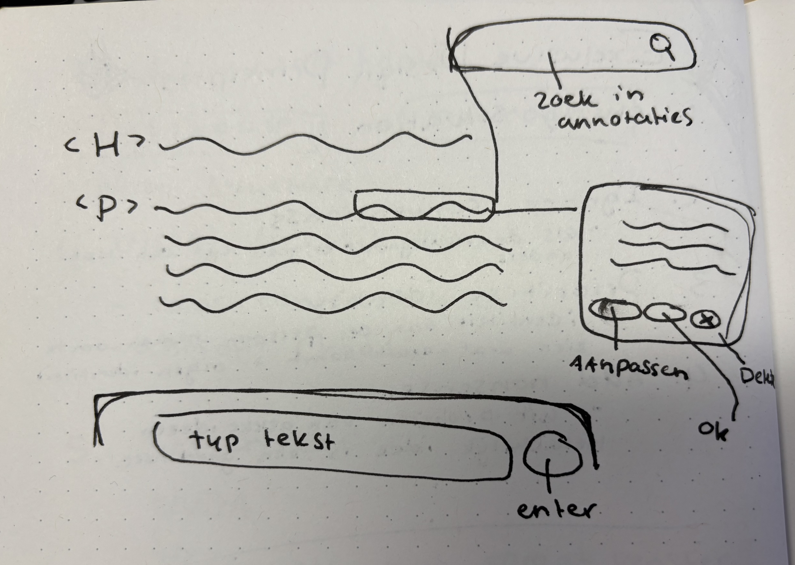

Tekst die je kan uploaden? Die komt dan in het midde van het beeld te staan, onderin is een typ balk, zodat hij de annotaties kan typen en kan uploaden zodra hij met de screenreader iets geselecteerd heeft.

*Note to self: Hoe kan je iets selecteren met een screenreader?*

Je hebt en andere zoekbalk op het scherm waarin je kan zoeken door je annotaties, je kan binnen de annotaties heb je buttons met aanpassen, ok en delete om ook aan te kunnen passen. De annotaties moeten ook tab baas zijn.

*Note to self: Is was hij wilt een extensie of moet het een aparte applicatie zijn?*

Als het namelijk een aparte applicatie wordt, dan kan er een upload scherm vooraf aan toegevoegd worden, zodat hij zijn boeken via daar kan annoteren en dan aan het einde wellicht downloaden?? Anders is het mogelijk om het als een extensie toe te voegen aan een e-reader bijvoorbeeld.

*Note to self: Hoe kan je een screenreader stopzetten middenin een stuk tekst?*
Dit verschilt per screenreader, dus belangrijk om te vragen welk device Roger gebruikt en eventueel welke screenreader.

Hoe selecteerd Roger een stuk tekst, anders kan ik als hij iets geselecteerd heeft en dan op enter klikt dat dan de panel geopend wordt met de mogelijkheid om iets in te vullen. 

**Eerste stappen Code**
Als eerste wil ik kijken hoe ik iets moet selecteren en de data ervan kan loggen om te zien hoe het werkt, zodat het geselecteerde item daarna gebruikt kan worden om die selectie te onthouden.

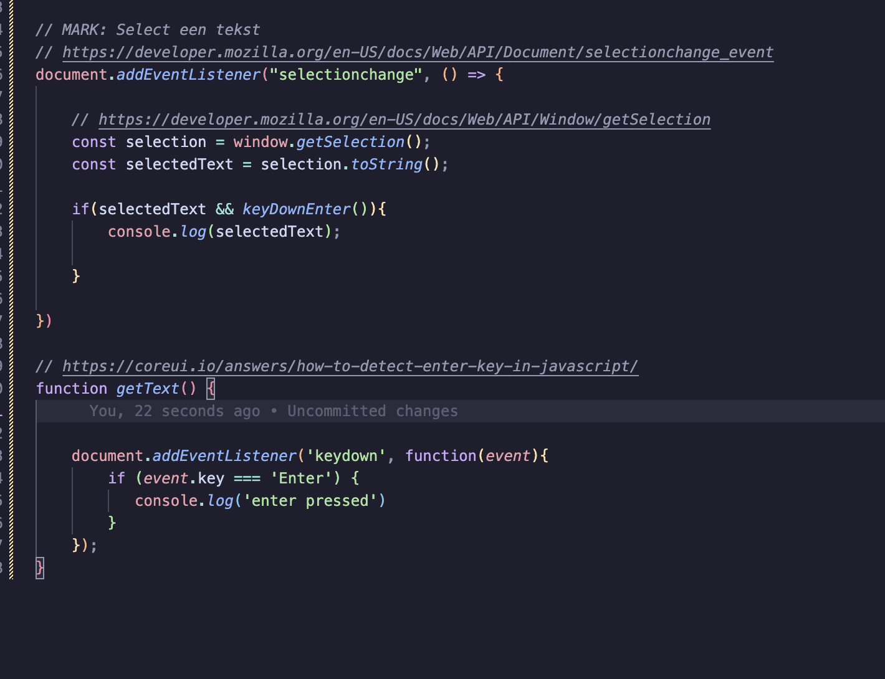

De selected tekst werkte wel, alleen dan logt hij alles, dus ik wil voor nu dat hij op een trigger enter ook nog reageerd.

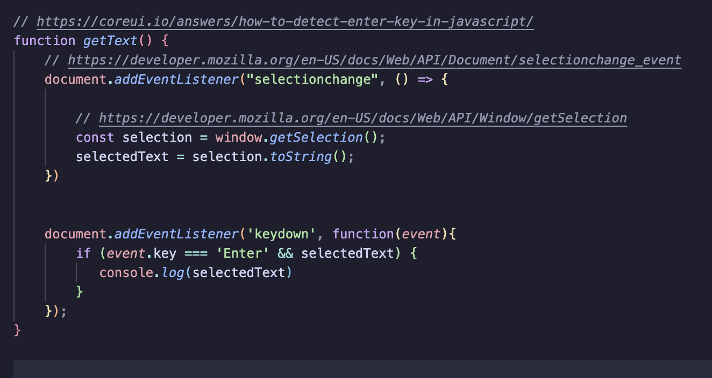

#### Testplan
##### Voorbereidende vragen voor Roger 
- Welke screenreader gebruikt hij?
- Kan hij nog een beetje zien is hij volledig blind?
- Waar liggen zijn interesses? Wat voor filosofische boeken leest hij?
- Via wat leest hij zijn boeken? 
- Is was hij wilt een extensie of moet het een aparte applicatie zijn? 

- Waar heeft hij baat bij met een screenreader?
- Welke browser gebruikt u? 

- Hoe gebruikt u de screenreader? Hoe selecteerd u een onderdeel uit een stuk tekst
- Kan u tekst selecteren met een screenreader?
- Wilt u annotaties bij woorden, zinnen of paragrafen maken?

##### Wat wil ik dat hij nu test?
- Ik wil kijken of hij iets in een stuk tekst kan selecteren, met de toetsenbord. 
- Hoe hij uberhaupt met een screenreader werkt.

### Voorbereiding weekly geek
Geschreven door Vasilis van Gemert 
- https://exclusive-design.vasilis.nl/
-https://exclusive-design.vasilis.nl/flipping-things/ 
1. Study situation: bestudeer de doelgroep 
2. Ignore conventions: Niet elke convention werkt vooe iedere doelgroep
Patterns we take for granted, like a navigation at the top of every page, make no sense to certain screen reader users.
3. Priotitise identity: design with people
or instance identity plays an important role as well. Identity is interesting. There’s brand identity, there’s the identity of the design team, but there’s also the identity of the people who use your website
4. Add nonsense: hoe kan je een functionele design naar een next level brengen
It says to consider the value of features and how they improve the experience for different users. It doesn’t seem to make any sense to not do this.
Adding nonsense to the mix can help in coming up with completely new ideas.

Why because we can

### Checkout
Vandaag gedaan met Matthew. 

#### Wat heb ik gedaan?
Ik heb nagedacht over waar ik mee ging starten en heb daar een start aan gemaakt, en ben daarbij ook begonnen met een nog wat algemene functie schrijven, omdat ik nog op veel vragen een antwoord moet krijgen om goed verder te kunnen, dus ik maak nu een prototype op basis van aannames als eerste iteratie.

#### Hoelang heeft dat geduurd?
- 09:30 - 10:30 Uitleg van de opdracht
- 10:30 - 12:30 Start gemaakt aan readme, vragen bedacht, javascript function geschreven.
- 12:30 - 13:30 pauze 
- 13:30 - 15:00 Verder werken en proberen toevoegen van een html article, kijken hoe het zit met de select en een toetsenbord.
- 15:00 - 16:00 weekly geek voorbereiden
- 16:00 checkout

#### Wat heb ik geleerd?
Ik heb geleerd dat er een select methode en een focus() is in javascript, dit kon handig zijn, maar het werkt niet zoals ik wilde.

#### Wat ga je morgen doen?
Verder kijken naar een andere mogelijkheid voor de select. Misschien proberen met een focus state op het element of er door javascript allemaal spannetjes eromheen te zetten kijken of dat werkt.
- Kijken of ik de focus state kan fixen
- testplan formuleren

### Iteratie 1: 0-meting
Ik heb op visueel vlak niet veel gedaan, ik ben gaan kijken naar de functionaliteit om te selecteren.
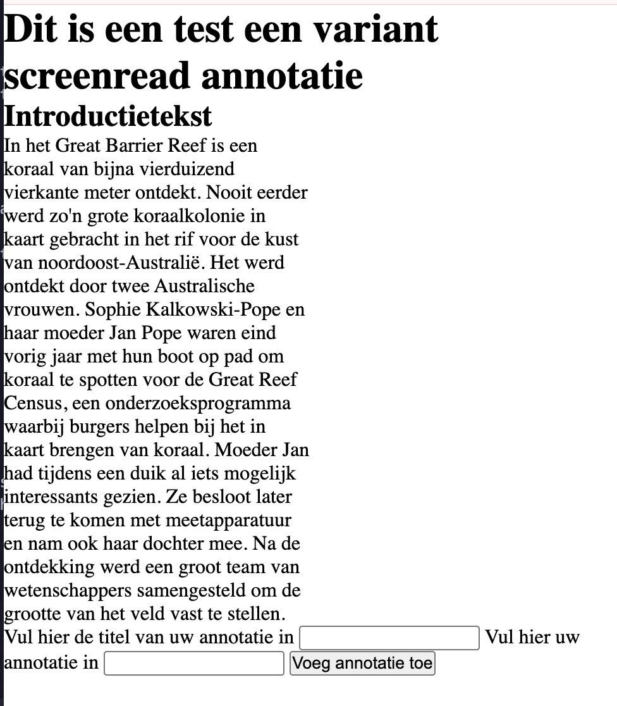

Alleen het selecteren gaat alleen met de muis, ik heb onderzocht of het mogelijk is om met een toetsenbord te doen alleen dat lukt niet. Dus ik wil kijken in hoeverre Roger al blind is en of hij met een muis werkt/wil werken. En anders ga ik kijken of ik dit nog anders kan doen en het per zin met spans ga doen. 

Of er is een manier waarop ik het anders kan doen, maar dat moet ik even nog in gaan duiken. Maar daarvoor is het handig voor mij als ik antwoord krijg op de vragen die ik hiervoor heb beschreven.

## Week 1: Dinsdag 31 maart
### Proces
Vandaag is de dag van de eerste test en ik wil eerst de situatie waarvoor ik iets moet maken beter begrijpen en begrijpen waar Roger meer behoefte aan heeft en wat al zijn mogelijkheden zijn.

Omdat ik gister niet kon vinden of je met een keyboard iets kan selecteren ben ik vandaag alvast bezig geweest om de teksten die ik heb daar een span van te maken.
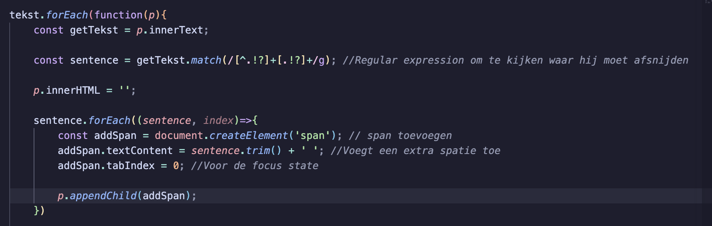

Uiteindelijk heb ik het ook kunnen combineren met het eerder geschreven spraak bericht. En dat werkt, alleen werkt mijn focus state nog niet, ik wil namelijk dat als hij klaar is met voorlezen dat hij dan de focus zet op een eventuele input alleen dit werkt niet. Ik probeerde het eerst met een onend, alleen ik las dat dat niet werkt omdat het een async functie is.
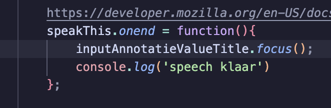

Dus daar moet ik iets anders op bedenken. 

Ik ben vandaag bezig geweest met het maken van de functie om geselecteerde tekst nog een keer voor te lezen zodra je het selecteerd. Alleen toen ik het zelf ging testen met een screenreader en dan op enter klikte las hij het stuk nog een keer voor maar dan met een engels browser stem. Dat werkt niet helemaal lekker.

*Note to self: Stem aanpassen in browser + een oplossing vinden dat hij op een ander moment praat.*

*#### Study situation*
Wie is Roger en waar heeft hij behoefte aan? 
Hoe kan hij notities terug vinden. Aantekeningen maken bij het studeren. Moeite met aantekeningen terug te vinden bij de boeken.

#### Testplan
##### antwoorden van Roger 
- Welke screenreader gebruikt hij?
Ingebouwde op mobiel Iphone. Gewoon super nova, nvde nova op zijn laptop. Want hij heeft geen macbook.

- Kan hij nog een beetje zien is hij volledig blind?
Hij ziet wel kleuren, maar wordt steeds verder aangetast. Omdat de kegeltjes steeds verder weg gaan. Contrast en lichtgevoeligheid. Van licht naar donker en visa versa moeite. Hij keert alles om heeft zijn telefoon in darkmode staan.

Hij ziet zogezegd als je je vuist voor je gezicht houdt.

Het is een grote blur. 

Wel een woord, maar niet een hele zin.

- Waar liggen zijn interesses? Wat voor filosofische boeken leest hij?
Filosofische boeken. Misschien heeft hij nog wat dingen.        

- Via wat leest hij zijn boeken? 
Luisterboeken gebruikt hij. Tot zich nemen met spraak. 
Aantekeningen zoals word, maar dat werkt ook niet optimaal.

dedicom loket waar hij zijn boeken koopt in edutekst

Het is lastig om boeken in word te krijgen. Filosofische boeken zijn moeilijker te krijgen.

- Is was hij wilt een extensie of moet het een aparte applicatie zijn? 
een tool waar hij aantekeningen kan maken en terug kan vinden. Waar je eventueel aan 

- Welke browser gebruikt u? Welk device?
Beide onderweg veel op de telefoon, maar dan kan hij geen aantekeningen maken.  Maar is wel behoefte naar, maar hij weet niet hoe.

Maar leren op de computer, om makkelijker aantekeningen te maken.
Blind typen lukt ook wel voor 80%.

- Hoe gebruikt u de screenreader? Hoe selecteerd u een onderdeel uit een stuk tekst?

- Kan u tekst selecteren met een screenreader?

- Wilt u annotaties bij woorden, zinnen of paragrafen maken?
Hij maakt nu per bladzijde aantekeningen, maar hij is nog zoekende in wat voor hem het beste werkt.

- Hoe maakt hij aantekeningen?
Hij neemt het soms op, en maakt wel soms aantekeningen. Met word kan je aantekeningen maken, maar het terugvinden is lastig. Het moet handiger kunnen. 

Voorkeur: whatsapp gebruikt hij vaak auditief, is wel fijn en heeft een voorkeur. En met stotteren wordt het wel iets lastigers. 
Hij typt wel liever. Maar beide opties zijn interessant.

- Wat wilt u niet zien?
Dat het zegt dat het toegankelijk is, maar dat het niet is. Niet iedereen heeft skills op een hoog lever, net als braille.

- Lastig vindt
Wil nog liever iets? in word dan alleen maar een website. Kan wel voorlezen dat kan wel goed werken, maar op studie gebied, dan moet je kunnen kopieren en in een ander bestandje.

Spraak kan soms ook wel storend zijn. 

Plaatjes kunnen omzetten in tekst. 

- Indeling van concepten?
Liefst per boek aantekeningen kunnen maken.
Nu per bladzijde, een ordening. Koppenstructuur wel fijn.

##### Opmerking tijdens een aantal tests
- Niet een tab om terug te gaan
- Liefst inladen document
- Grotere letters
- Accent color is vervelend, maar helpt wel
- Navigatie binnen de tekst moet beter.

- Vooraf controls voorlezen, hij is het nog niet over uit welke zijn voorkeur heeft.
- Hoe kan hij opmerkingen vinden. 
- Zwart op geel is een prettige manier voor het contrast.

### Weekly geek bespreken
Gedaan met wooclap.

### Checkout
#### Wat heb ik gedaan?
Ik heb een function geschreven voor de span, zodat je kan tabben door de verschillende zinnen heen en dan kan hij deze voorlezen.

#### Hoelang heeft dat geduurd?
- 09:30 - 10:00 weekly geek
- 10:00 - 12:30 verder werken, functie geschreven voor de spannetjes
- 12:30 - 14:00 pauze 
- 14:00 -16:00 Gesprek met Roger.

#### Wat heb ik geleerd?
Ik ben weer een stapje verder gekomen met javascript, met het begrijpen en verschillende functionaliteiten toegepast zoals match() en trim()

#### Wat ga je morgen doen?
Op basis van de iteratie ga ik verder met maken. 
- Achtergrond kleuren en kleuren aanpassen
- Als je op Enter klikt dat je dan kan typen
- Bestand upload maken
- Notitie maken werkend
- Zoeken in notities

### Iteratie 2: Plannen na eerste gesprek
[x]Achtergrond kleuren en kleuren aanpassen
[x]Als je op Enter klikt dat je dan kan typen
[x]Notitie maken werkend
[]Bestand upload maken
[]Zoeken in notities
[]Localhost fixen zodat het opslaat on refresh
[]Verwijderen notitie fixen
[]Light dark mode + lettergrootte aanpassen maken
[]Notitie linken aan de zinnen

#### Iteratie

Op basis van het eerste gesprek, ben ik daarna nog even doorgegaan en ziet het er als volgt uit.
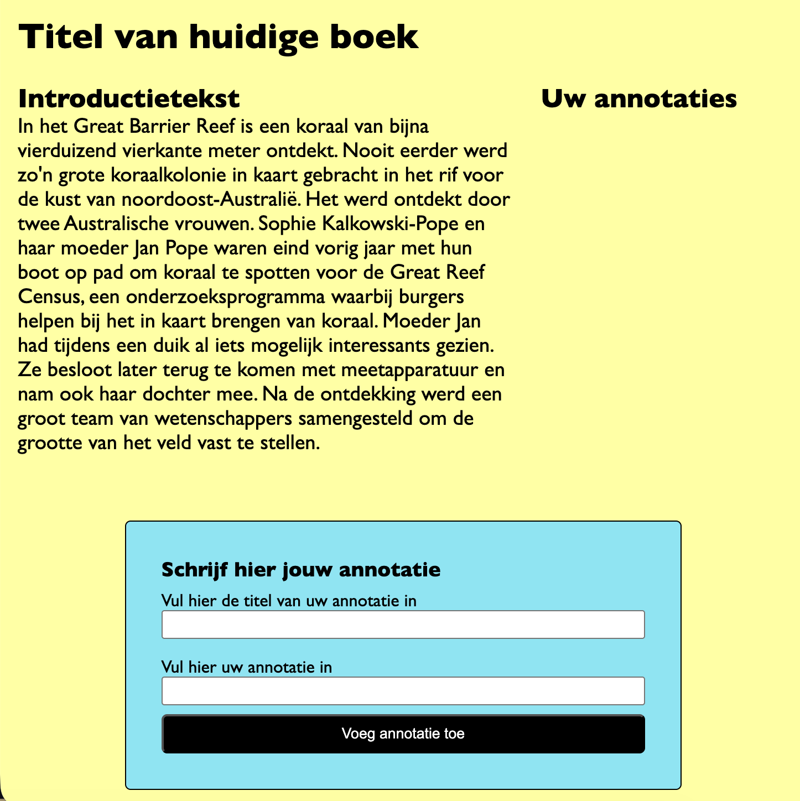

Zoals je hierboven ziet zijn de kleuren aangepast op basis van wat Roger heeft verteld tijdens het gesprek.

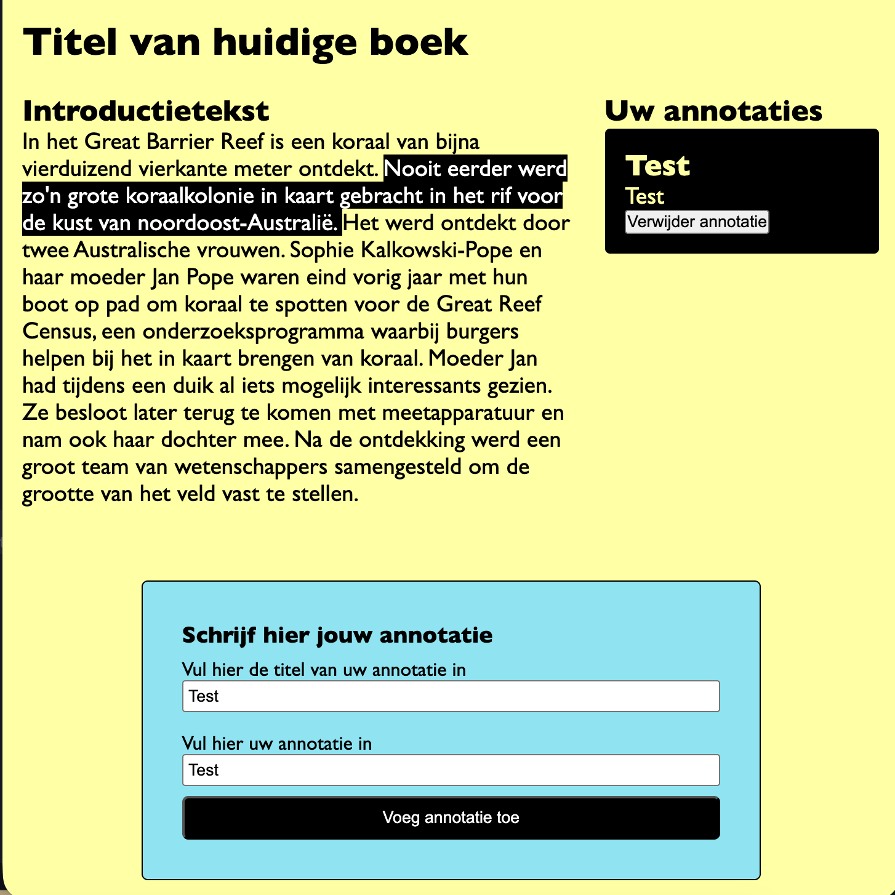

### Wekelijkse gesprek
- Cool dat hij het voorleest, maar leg de focus op andere dingen. Roger heeft namelijk de manier van een voiceover geleerd. 

add nonsense 

Focus op meer informatie krijgen van Roger, dus ik ga ook wat meer vragen ook stellen aan hem. 
Zoals: 
- Welk lettertype werkt het beste voor jou?
- Wat vindt u van deze gele kleur op de achtergrond?
- Welke shortcuts kent hij/heeft hij op zijn laptop?

Aria labels is interessant om naar te kijken, om de ervaring van de screenreader beter te maken voor hem. Om zijn frustatie af te nemen.

Wat wil je Roger voorleggen voor de volgende keer? 

### Wekelijkse reflectie
Het was als ik er zo op terug kijk toch allemaal wat lastiger dan gedacht, omdat je niet zo goed wist waar ik moest beginnen. Bovendien had ik ook niet echt een idee in hoeverre Roger blind was, dus ik ging er in eerste instantie vanuit dat hij zo goed als helemaal niks zag en ben begonnen met de screenreader en daar iets uit kunnen selecteren. Dat is uiteindelijk gelukt, in eerste instantie had ik het kunnen selecteren met een muis, maar niet in gedachte gehouden dat het niet mogelijk was om met een keyboard een deel te kunnen selecteren.

Dus dat was weer even een ohja moment. Uiteindleijk na het eerste gesprek was het toch wel fijn om Roger ontmoet te hebben want nu weet ik ook wat hij zou willen en waar zijn behoeftes een beetje liggen en kan ik verder gaan met mijn design voor hem. Tussendoor ontdek ik toch dat ik nog wat informatie mis, maar deze vragen sla ik op en zal ik bij het volgende moment aan hem stellen.

## Week 2: Maandag .. april
### Proces
De maandag is een vrije dag, maar ik ben na afgelopen dinsdag nog bezig geweest.

Nu werkt mijn focus() ineens wel. Hoe ik heb geen idee, maar hij doet het nu. Het kan liggen omdat ik de functie uit een andere functie heb gehaald, maar geen idee.

*#### Verwerkte iteraties*
Op basis van de test, heb ik het design aangepast, Roger gaf aan dat hij zwart op geel fijner vindt om naar te kijken, dus heb ik het design zwart op geel gemaakt.

#### Testplan
##### Voorbereidende vragen voor Roger op basis van de vorige iteratie
- Welk lettertype werkt het beste voor jou?
- Wat vindt u van deze gele kleur op de achtergrond?
- Welke shortcuts kent hij/heeft hij op zijn laptop?

### Weekly geek Voorbereiden
Geschreven door Leonie Watson, 8 augustus 2025.

Heel interessant over hoe zij de problemen binnen een product omschrijving aankaart. Want zo heb ik er nooit naar gekeken. 

AI integreren is heel handig, maar blijft dat wel? Kan chat wel voor  de gebruiker op een fijne manier iets omschrijven of zijn er nog steeds punten waar ze de mist in gaan.

### Checkout
N.V.T

## Week 2: Dinsdag 7 april
### Proces
Vandaag heb ik al mijn tweede test.

Ik ga op basis van de feedback van Leonie, de speech die ik heb geschreven in javascript helaas weghalen, ik was er wel trots op alleen het is niet handig want de screenreader leest het toch al voor.

### Iteratie 2: Na eerste gesprek

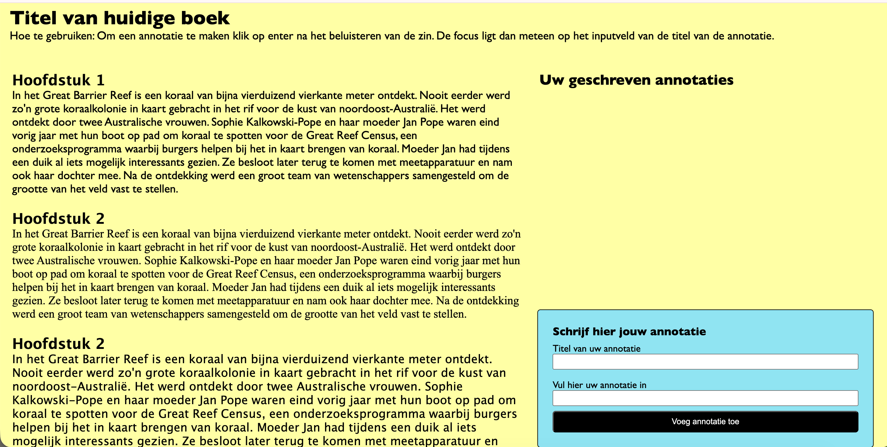

Tijdens de test wil ik testen welk lettertype hij ook het meest prettig vindt om naar te kijken, zodat het voor hem ook fijner kan werken en dat hij minder snel vermoeid wordt. Dus ik heb voor het testen een aantal opties neergezet, zodat hij kan kijken welke hij het beste vindt en misschien heeft hij wel een ander die voor hem prettig werkt, ik laat dit volledig open.

Daarnaast heb ik de flow met de screenreader getest en met het tabben en dat werkt naar mijn idee ok. Maar ook dit wil ik laten testen door Roger en ik wil nu gewoon feedback krijgen op wat ik heb.

#### Testplan
Ik wil Roger door mijn site laten tabben en kijken hoe hij het ervaart, daarbij wil ik vragen wat hij van de kleuren vind en de lettertype en of hij eventueel een voorkeur daarin heeft.

Vragen aan Roger:
- Welke lettertype gebruikt u doorgaands?
- Wat vindt u van het kleurgebruik? 
- Hoe is de opzet van de pagina? wat vindt hij van de annotities optie binnen het scherm blijft?

Daarnaast wil ik de focus van mijn test leggen om te kijken wat hij van de automatische focus vind naar de annotatie. Kijken of dit lekker werkt of niet.

#### Uitkomsten uit de test en die van andere
Hij komt meteen al binnen met dat hij zijn mobiel op iets wil aansluiten, dus dat wordt nog een verbeterpunt, want ik heb het gemaakt voor Word op de laptop.

NEVER MIND NO STRESS - het was voor hoe de boeken werken.

Door zijn telefoon swiped hij door de stukken tekst heen. 
- Pinch en draai om de instellingen te krijgen op de telefoon.
- doubble tab om te selecteren en te openen van bestand. 

MAkkelijker maken en navigeren met een tool op de telefoon een boek kan lezen en aantekeningen maken of op de ipad in ieder geval voor een ipad.
- hij gebruikt een draadloos toetsenbordje om te typen
- Via bladzijdes weten, een opmerking kan plaatsen en het dan kan bundelen om het terug te kunnen vinden. 
- Darkmodus
- Nog geen goede structuur voor het terug vinden van de notities
- Laptop het liefst zo min mogelijk gebruiken. 

*Melvin:*
- Goeie contrast
- Hij gebruikt meerdere schermlezers om niet afhankelijk te zijn van eentje.
- annotaties binnen of buiten het scherm? --> duidelijk dat er wel een annotatie is en ook wel zien. 
- Geen specifieke lettertype, standaard is gewoon goed --> dikgedrukt - maar de focus ook om het non visuele.

- liever een oplossing waarbij er niet gelezen wordt. 
- Meer op spraak om de snelheid te verhogen.
- Voorlezen binnen een bestand werkt als een tierelier

*Jelle:*
- Waar kan je zien dat het geselecteerd is? 
- tabben werkt goed voor hem, esc werkt ook goed om terug te gaan.
- En een spatie om te selecteren

*Mijn test:*
- Kleur is iets te licht -- het donkere vond hij wel prettig om te zien.
- Hij kon er nog moeilijk doorheen komen en kwam snapte ook niet goed dat hij al iets kon invullen en door kon gaan om op te slaan.
- Blauw werkt ook goed voor hem
- Hij zou graag tussen alinea's en zinnen willen kunnen kiezen.
- Hij gaf aan dat een laptop ook wel prima is

Het werkte eigenlijk helemaal niet, omdat hij niet goed wist waar hij naartoe moest. Hij sloeg het begin tekstje ook over.
Dus er is nog werk aan de winkel.

*Jeppe:*
- Hij vindt groep voorlezen vervelend.
- A gaat snel bij het voorlezen. Anders had hij het sneller door gehad.
- Prima
- Hij blijft wat langer hangen tussen hoe te navigeren.

*Naoufal:*
- Optie om meerdere stemmen te installeren
- Alinea's sprak hem wel aan.

*Ocean:*
- De toetscombinaties zijn wat lastiger
- niet iets vooraf annoteren, dat brengt verwarring bij hem om te zien of er iets al geannoteerd is.
- Tekst is leidend, annotatie is bijzaak. 
- een bolletje voor een zin dat kan hij zien en 
- Liever iets bewerken wat er al is, binnen een annotatie en niet nog een nieuwe annotatie erbij dezelfde zin
- Pad om te vinden is pagina's zijn toch wel bladzijdes of hoofdstukken

*Teun:*
- Hij stuikelt nog wel over het lezen 
- Tab doet hij wel
- Meteen door naar de volgende zin in plaats van weer terug naar de zin waar je je annotatie al hebt gemaakt.
- Een tekentje voor de zin, om aan te geven dat er een annotatie bij zit.

*Kelly:*
- Fijn om ook te kunnen typen als je met spraak bezig bent.

##### Wat ik meeneem uit de test:
- Highlighten van de geannoteerde tekst
- Per bladzijdes -> Kunnen tabben tussen alinea's en vervolgens daarbinnen de zinnen kunnen voorlezen.
- Bij het punt van de enter was hij meteen in het vakje, daar had ik de focus state op gezet alleen dit was een totale flop, dit werkte niet goed, dus ik ga even kijken hoe ik dit nu wel beter kan doen.

- Bij de volgende test benoemen wat de controls zijn

### Weekly geek bespreken
Weer via wooclap.

### Checkout
#### Wat heb ik gedaan?
- ik heb de flow getest en met een screenreader bekeken.
- de test gedaan met Roger en op basis van wat hij vertelde of wat ik observeerde alvast nagedacht wat ik nu verder aan ga doen.

#### Hoelang heeft dat geduurd?
- 09:30 - 10:15 weerkly geek
- 10:15 - 12:00 getest en in groffe lijnen aangepast voor de test
- 12:00 - 13:00 pauze
- 13:00 - 14:00 
- 14:00 - 16:00 Test met Roger
- 16:00 -  readme bijgewerkt en test hierin gezet etc.

#### Wat heb ik geleerd?
Ik heb geleerd dat AI handig kan zijn bij het beschrijven van producten voor de screenreader.

Het is toch lastiger ontwerpen voor een gebruiker die de screenreader gebruikt, ik dacht dat ik nu wel heel dichtbij kwam, maar het was eigenlijk helemaal niet goed omdat hij op een gegeven moment de weg kwijt was.

#### Wat ga je morgen doen?
- De kleuren aanpassen naar donkerder, hij gaf aan dat hij dat wat ik nu had toch te licht vond.
- Dat de annotatie waar die zit een andere kleur of icon krijgt.
- Bij het punt van de enter was hij meteen in het vakje, daar had ik de focus state op gezet alleen dit was een totale flop, dit werkte niet goed, dus ik ga even kijken hoe ik dit nu wel beter kan doen.

### Weekly Checkout
Deze week ging qua maken wel goed, alleen tijdens het testen kwamen er weer dingen aan het licht waar ik overheen had gezien of niet aan had gedacht. Dus dat moet ik voor volgende week aanpassen en een nieuwe manier voor bedenken. 

Ik vind het nog wel lastig dat ik iets moet maken voor iemand die de sneltoetsen van de screenreader best lastig vindt en ik merkte bij andere test dat zij vooraf de shortcuts hadden uitgelegd en dat hij het daarna veel beter begreep, dus dat ga ik voor de volgende test ook doen. 

- focussen op de flow en dan manier waarop de screenreader praat.
- Donker modus
- Lijstjes en structuur creëeren om tussen hoofdstukken heen zou kunnen gaan.
- kijken naar role attribute 

idee:
- Per hoofdstuk een list item en binnen list item kunnen tabben door de zinnen en dan enter klikken om een notitie te maken.

Het gesprek aan het einde van de week heeft mij weer op een nieuw idee gebracht wat ik gewoon wil proberen. 
Leonie had het over het maken van een list item, en toen dacht ik aan een inhoudsopgave, wat als je via daar kan tabben tussen de hoofdstukken en dat hij dan het aantal annotaties voorleest en dat je op enter kan klikken op binnen dat hoofdstuk te komen.

## Week 3: Maandag 13 april
### Proces
Vandaag ga ik mijn idee uitwerken op basis van de feedback die ik heb gekregen vrijdag tijdens de feedbacksessie. Ik heb daardoor ook een nieuw idee bedacht en wil de ervaring zo duidelijk en prettig mogelijk maken voor Roger.

Dit was mijn eerste opzet voor mijn html:
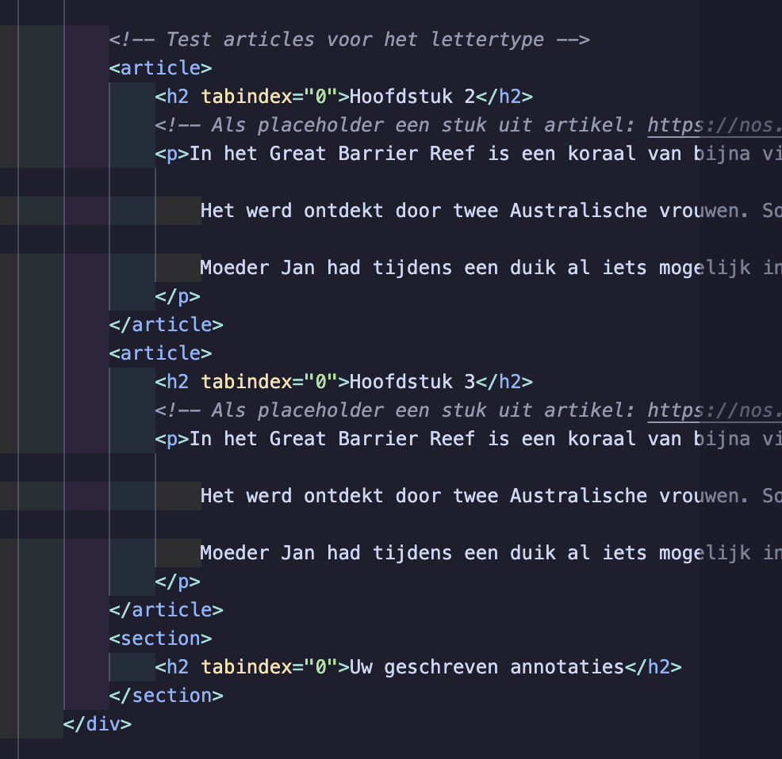

Uiteindelijk heb ik nog een inhoudsopgave gemaakt, waarin Roger kan horen wanneer er bij welke hoofdstuk hoeveel annotaties zijn. Hij kan de hoofdstukken openen door de link te openen via enter of de spatiebalk, uit de test van andere bleek namelijk dat hij spatiebalk ook prettig vond om te gebruiken. En zo hou ik mijn volgende ideeën ook consistent.

Ik heb nu bij de aticles ook een tabindex toegevoegd, zodar hij ook eerst de articles langs kan gaan. Alleen moet ik nog een function schrijven, waarbij hij alleen de articles langs tabt en dan zodra hij op spatie klikt de articles binnenin langs kan gaan. Maar wel dat hij de articles bij het eerste keer tabben ook voorleest.

Ik heb voor elkaar gekregen dat je eerst een lijst hebt met hoofdstukken en ik heb bij de alinea's de instructies tijdens dat hij bij de alinea zit gedaan, want ik merkte tijdens mijn vorige test dat hij bij de instructies in het begin meteen voorbij ging.

Zie hieronder hoe mijn html er nu uitziet: 

Misschien dat ik de articles moet veranderen naar een lijst, want dan heb je de structuur van een lijst.

Ik heb het aangepast naar een list item en de tabindex binnen de container van de list-items gezet alleen dan leest de stem het heel raar op.
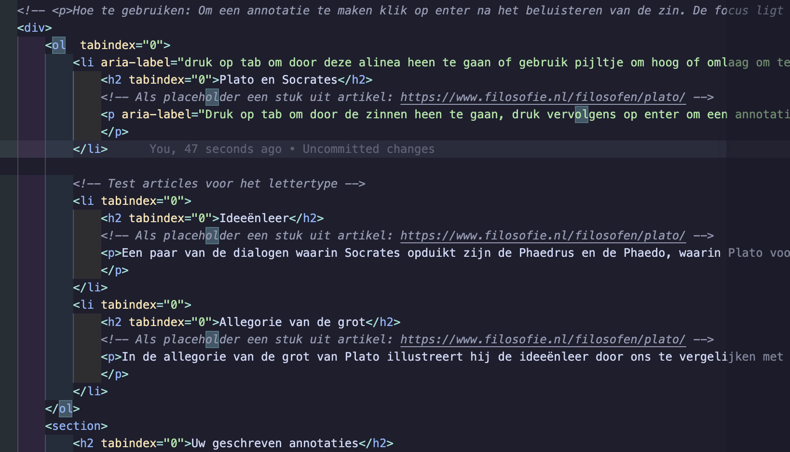

Maar zodra ik het in de list item zette pakte hij het wel goed, maar leest hij het ook nog eens raar voor.
Dat lag simpelweg aan de tabindex die ik nog had meegegeven.

Daarnaast heb ik ook nog een markering gegeven aan de tekst, zodat Roger kan zien waar hij een annotatie heeft gemaakt.
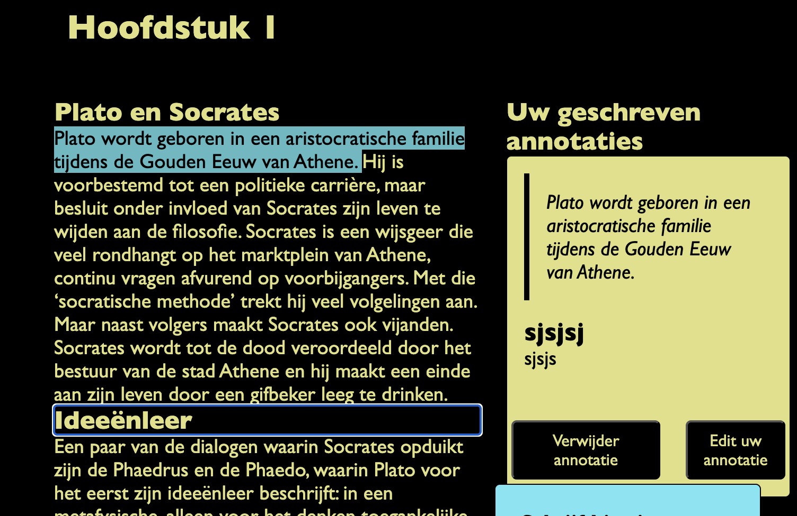

#### Testplan
Ik moet bij Roger duidelijk zijn met dat de mannelijke stem van mijn voiceover voor de structuur is en de belgische meer voor de content is en dat hij daar meer naar moet luisteren.

Ook ga ik vooraf uitleggen aan hem wat welke toets doet, zodat hij het al een keer gehoord heeft.

tab = van boven naar beneden door alle elementen
pijl omhoog en omlaag = door de alinea's heen wisselen
enter = annotatie maken
esc = is terug van de form naar de geselecteerde tekst

##### Voorbereidende vragen voor Roger 
- Wat vindt hij van de hulp stukken tussen de teksten?
- Wat vindt hij van de flow?
- Werken de knoppen goed voor hem?
- Vindt hij het nodig om een titel te kunnen toevoegen? 

ADD nonsense idee voorstellen:
- Zou u er baat bij hebben om de kleuren te kunnen aanpassen bij de annotatie? Om ze zo sneller terug te kunnen vinden?

### Weekly geek voorbereiden
geen deze week

### Checkout
#### Wat heb ik gedaan?
Ik heb de flow aangepast met aria labels zodat hij voorleest wat zijn mogelijkheden zijn, ik wil dit met hem gaan testen.
Ook heb ik de verwijder button gefixt en heb ik de achtergrond aangepat naar een darkmode.
Ook heb ik een markering toegevoegd zodra hij iets geselecteerd heeft. En heb ik de articles aangepast naar een list item zoals ik had besproken met Leonie, zij zei dat het een betere oplossing zou zijn en de aria-label dan beter zou werken en dat doet het inderdaad.

#### Hoelang heeft dat geduurd?
- 09:30 - 13:00 gewerkt aan de opdracht
- 13:00 - 14:00 naar huis gaan
- 14:00 - 16:00 markering gefixt + article > li

#### Wat heb ik geleerd?
Ik heb geleerd dat een aria-label ervoor zorgt dat de tekst ook niet meer wordt voorgelezen met de screenreader. Dat wist ik namelijk niet. Ook heb je in javascript een contain() waarmee je kan checken of een element iets bevat en dat je een preventDefault() kan toevoegen zodat hij de default keyboard dingen niet doet en in plaats daarvan je eigen ingestelde/gemaakte function uitvoerd.

#### Wat ga je morgen doen?
- De edit button fixen. 
- Testen met Roger
- Feedback verwerken.
- Zodra je door de annotaties heen tabt dat als je dan op enter klikt dat je dan meteen terug gaat naar het stukje tekst?

#### Wat ik laat testen
- De flow tussen de alinea's
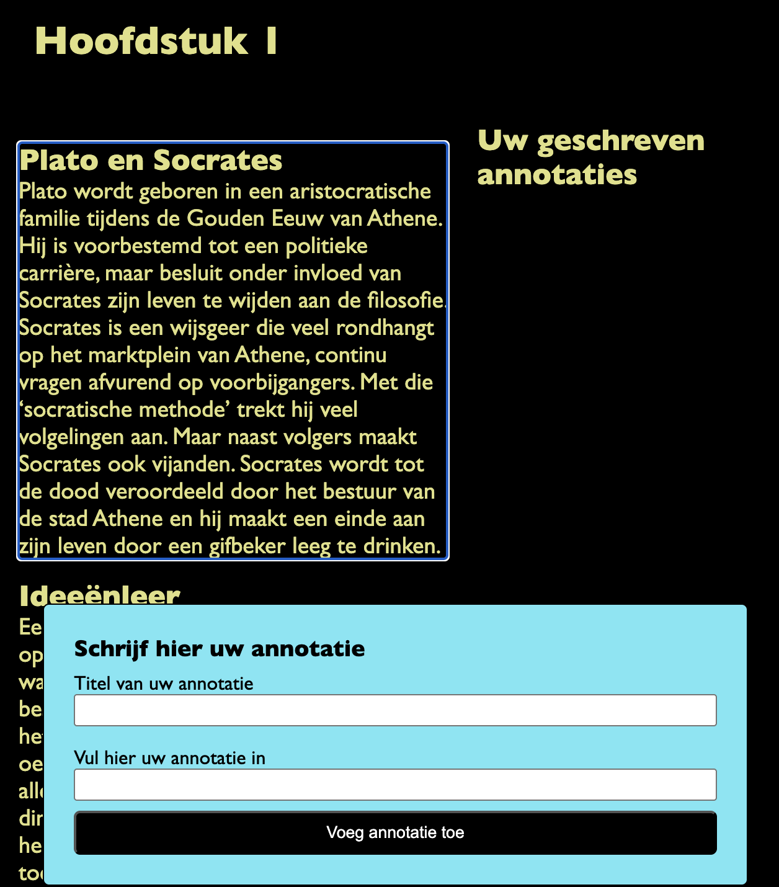

- De markering en de nieuwe focus point bij het formulier.
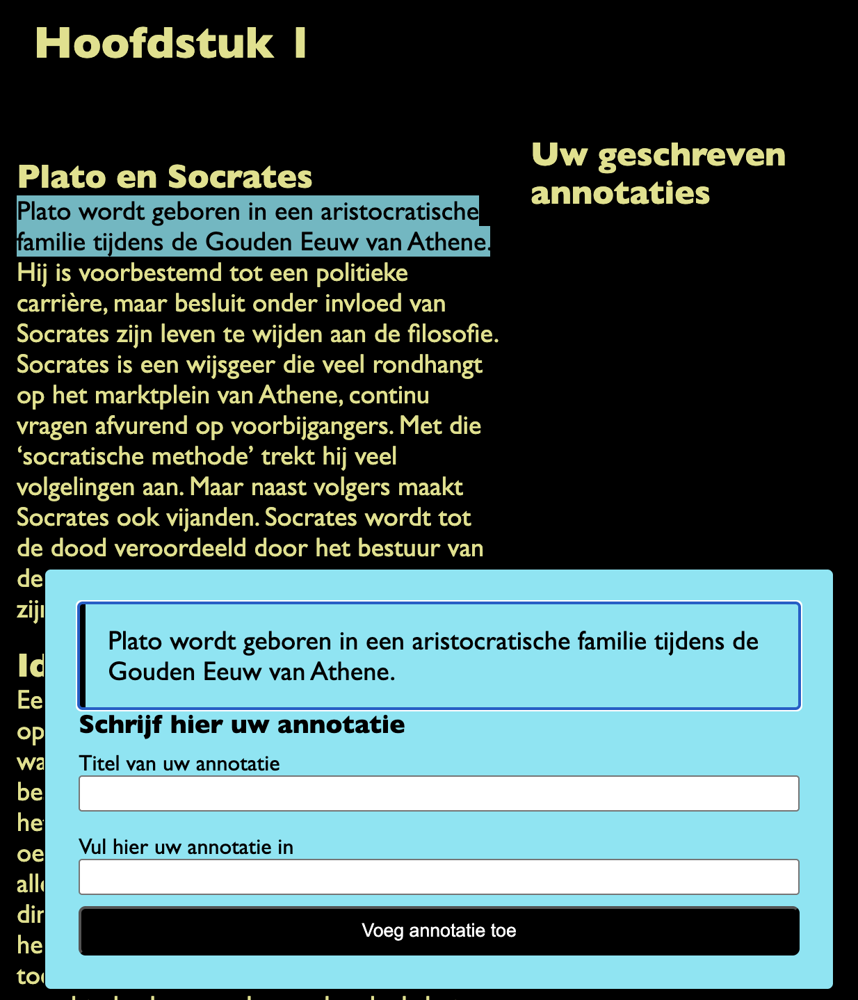

## Week 3: Dinsdag 14 april
### Proces
Vandaag wil ik stilstaan bij de vier principes die wij tijdens die vak behandelen:

'We werken met de exclusive design principles:'

*Study situation*
In het begin van dit vak kregen we te maken met een doelgroep waarvoor ikzelf nog nooit ontworpen heb. Zelf maak ik ook vrij weinig gebruik van de screenreader, dus wilde ik kijken hoe Roger hiermee omgaat en waar zijn behoefte liggen.

*Ignore conventions*
Tijdens het bestuderen van de situatie kwam ik erachter dat Roger niet veel snelcodes/ nog niet helemaal thuis is met wat de screenreader allemaal kan. Dus die functionaliteiten laat ik links liggen en ik ben zelf shortcuts gaan bedenken/toevoegen die voor hem logischer zijn om te gebruiken en om zo iets te maken wat ook echt bij hem past. Daar wil ik vandaag op testen.

*Prioritise identity*
Roger ziet nog wel een beetje en daarom heb ik bij de tweede test gevraagd naar de kleuren, of het de juiste kleuren waren en of er iets anders moet, zodat zijn identiteit terug komt door middel van zijn voorkeuren.

*Add nonsense*
<!-- Wat nou als dit dat doet? Vragen stellen als het niet lukt om het te maken. -->
Zou het voor hem werken om de kleur van de annotatie aan te kunnen passen? Naar mijn idee lijkt dit niet echt een goed idee, omdat er dan misschien te veel voor hem gebeurd?
- Ik kan dit aan hem voorstellen en als hij er wel enthousiast over is dan ook uitvoeren.

#### Tijdens de test
##### Vragen voor Roger
- Wat vindt hij van de hulp stukken tussen de teksten?
- Wat vindt hij van de flow?
- Werken de knoppen goed voor hem?
- Vindt hij het nodig om een titel te kunnen toevoegen? 

ADD nonsense idee voorstellen:
- Zou u er baat bij hebben om de kleuren te kunnen aanpassen bij de

##### De tests
*Test van Jeppe*
- Hij klikt op control en vervolgens op alt
- Hij drukt op tab om te wisselen tussen de toetsen.
Hij gebruikte gelijk zijn eigen gemaakte sneltoets om een notitie te maken

- zij spoor over straat in amsterdam met filosofen
Hij drukte denk ik een keer te snel op tab 

Shift tab om terug te gaan in eerste instantie, dus die werkt
Hij herinnerde de X ook wel meteen weer.

De grootte van de tekst is zo goed, hij ziet het toch niet. Gele is wel fijn zo. In combinatie met de kleuren en de hoeveelheid aan zinnen is zo fijn, het moeten niet meer zinnen zijn. 

Leuk om sneltoetsen te kiezen, iedere screenreaders werken anders supernova en voiceover. Hij heeft nog niet de stap gemaakt om over te stappen op macbook. 

*Test van mij*
- Weer verward door structuur tekst met control-option-pijl omhoog
- Navigeert even door hoofdstukken en gaat vervolgens een hoofdstuk luisteren
- Toen wilde hij annotatie maken, wist niet hoe hij daar kwam, was het vergeten
- Hij gaat op zoek: navigeert door het hoofdstuk met tab
- Had niet goed door waar de focus was (dacht dat hij in h2 was maar was in laatste zin h1 (screenreader focus border was groter dan die laatste zin en omvatte daardoor heading van hoofdstuk 2)
- Voorzeggen annotatie maken is met enter, hij gaat notitie maken, vult titel in, ziet vervolgens niet waar de focus is en snapt niet hoe hij in het notitie tekstvak terecht komt
- Legde wel soort van de link tussen de blauw gemarkeerde tekst en de annotatie, maar tijd tussen annotatie maken en zin horen was lang geleden dus het leek erop dat hij zich niet meer goed kon herinneren wat de zin was, uiteindelijk opgeslagen, was niet helemaal duidelijk dat dit met enter moest
- Notitie verschijnt boven het formulier, hij snapt niet dat het opgeslagen is en leest het woord verwijderen, hij is in de war en zegt dat hij niet wil verwijderen maar wil opslaan
- Hij wil duidelijk zien welke notitie bij welke zin hoort
- Hij vindt het kleurgebruik goed maar het moet wat duidelijker
- Meteen hele stuk voorlezen vindt hij prettig maar dan wil hij markeren maar de voiceover stopt niet
- Voorzeggen dat ie met tab los door de zinnen kan en dan gaat ie annotatie maken
- Hij vindt zelf titel maken niet nodig, oppert om als titel automatisch titel van het hoofdstuk te doen zodat hij dat niet zelf hoeft aan te geven
- Annotatie formulier onthoudt vorige annotatie tekst
- Tweede keer lukt zelf opslaan van de annotatie wel
- Hij vindt pijltjes en tab fijn werken om te navigeren, moest vooral even inkomen

Uiteindelijk vond hij het wel tof wat ik gemaakt had. 

*Test van Joshua*
- Er wordt te veel gezegd door de voiceover
- Rood is niet een goeie kleur voor Roger
- Hij is de weg kwijt, hij zit buiten de viewport en weet niet goed hoe hij terug moet komen
- Hij wilt de screenreader op pauze kunnen zetten. 

*Test van Jelle*
Hij maakt ook foto's als reminder, of om het juist beter te kunnen zien. 

Op mobiel getest:
- Hij speelt zijn tekst heel snel af

- Pinch en draai om op te zoeken
- gestures programmeren om naar een tekstinvulveld te komen
Hij weet niet goed hoe hij moet navigeren door een pagina op de mobiel. 
- Door veeg bewegingen kan je door de pagina heen
- Via de regelaar iets kunnen instellen om een annotatie te maken

*Test van Nouafal*
- Ik weet niet of hij weet hoe hij met een screenreader alleen door de kop niveau's heen te gaan
- Daarmee kan hij makkelijker door de tekst heen gaan om makkelijk naar een deel van de tekst te navigeren, dus ik denk dat hij dat wel weet.
- is ook een idee per zin erdoorheen te tabben
- Hij kan niet goed vinden waar hij op dit moment is. 

*Test van Ocean*
- Hij vindt een toets Q wel fijn
- Hij vraagt hoe je moet navigeren en dat is enter
- Hij redt het wel om te zien maar je merkt dat hij even moet testen
- Wat is actief en wat is niet actief, waar ik ben is de highlight
- Tekst mag wel wat dikker of groter

*Test van Melvin*
- binnen de annotatie vind hij het lastig om te zien waat hij is 
- Hij weet niet zo goed hoe hij terug moet naar de tekst 
- Dubbele sneltoetsen werkt niet voor Roger, een toets is voor hem wat duidelijker
- Focus state bij tekstveld is niet zo goed zichtbaar

- lettertype: hij kan overal best wel goed mee omgaan, vetgedrukte lettertype

*Test van Kelly*
- Hij heeft een beetje moeite om door de hoofdstukken te selecteren
- Hij slaat meteen de sneltoetsen guide over
- Hij wilt graag de tab, en shift tab weet hij ook
- verwacht dat hij meteen gaat voorlezen, dus hij opent eerst de pagina en dan wilt hij dat hij het meteen voorleest.
- Kan niet goed zien waar je bent
- spreekt een beetje raar de engelse taal uit, maar dat kan
- Het werkt wel, dat hij de stem opneemt, maar hij blijft het voorlezen.

##### Wat ik meeneem uit de test:
Overall er zaten goeie punten in en ook punten die compleet mis gingen. 

- screenreader op pauze kunnen zetten? 
- Notitieveld leeg als je al een notitie hebt gemaakt
- Met verschillende kleuren werekn voor de annotatie om een contrast te creëeren. 
- Bevestiging geven zodra de notitie is opgeslagen
- Focus binnen het formulier was heel verwarrend, daar raakt hij de weg nog kwijt.
- Een annotatieveld weghalen, want hij begreep niet waarom hij een annotatie moest invullen 
- Bij form als je meteen op enter klikt dat de annotatie dan ook meteen op gaat slaan.
- dikgedrukte lettertype/iets vergrootte
- titel van alinea ook, als titel aangeven binnen het form, ipv dat hij het zelf invuld

### Weekly geek bespreken
n.v.t.

### Checkout
#### Wat heb ik gedaan?
- Stilstaan bij de principles
- laatste puntjes op de i gezet voor de code
- Test gedaan
- Feedback tot mij genomen

#### Hoelang heeft dat geduurd?
- 09:30 - 12:00 gewerkt aan mijn prototype 
- 12:00 - 13:00 pauze gehouden

- 14:00 - 16:00 test met Roger

#### Wat heb ik geleerd?

#### Wat ga je morgen doen?
Ik ga verder met feedback verwerken en iets proberen waarvan ik zelf denk dat het niet veel uitmaakt, maar misschien wellicht wel een goeie mogelijkheid kan zijn. 

## Week 4: Maandag 20 april
### Proces
Vandaag ga ik de feedback verwerken en ik ben op de volgende punten gekomen op basis van de test:
- screenreader op pauze kunnen zetten? 
- Notitieveld leeg als je al een notitie hebt gemaakt
- Met verschillende kleuren werekn voor de annotatie om een contrast te creëeren. 
- Bevestiging geven zodra de notitie is opgeslagen
- Focus binnen het formulier was heel verwarrend, daar raakt hij de weg nog kwijt.
- Een annotatieveld weghalen, want hij begreep niet waarom hij een annotatie moest invullen 
- Bij form als je meteen op enter klikt dat de annotatie dan ook meteen op gaat slaan.
- dikgedrukte lettertype/iets vergrootte
- titel van alinea ook, als titel aangeven binnen het form, ipv dat hij het zelf invuld

#### Testplan
##### Voorbereidende vragen voor Roger 

### Weekly geek voorbereiden

### Checkout
#### Wat heb ik gedaan?
- feedback van Roger verwerkt.
#### Hoelang heeft dat geduurd?
#### Wat heb ik geleerd?
#### Wat ga je morgen doen?

### Iteratie 4: Na eerste gesprek

## Week 4: Dinsdag 21 april
### Proces

#### Testplan
##### Voorbereidende vragen voor Roger 

#### Iteratie
##### Wat ik meeneem uit de test:

### Weekly geek bespreken

### Checkout
#### Wat heb ik gedaan?
#### Hoelang heeft dat geduurd?
#### Wat heb ik geleerd?
#### Wat ga je morgen doen?

### Iteratie 4: Na eerste gesprek

## Bronnen
### content
Voor test 1:
-  Als placeholder een stuk uit artikel: https://nos.nl/artikel/2603972-australische-moeder-en-dochter-ontdekken-koraalkolonie-een-weiland-van-koraal

- https://www.filosofie.nl/filosofen/plato/

### Javascript
#### Function geselecteerde tekst
- Function geoptimaliseerd met chatgpt: Prompt: Ik wil dat als je geselecteerd heb en dan op enter klikt dat je dan een consol log hebt met de tekst maar dit werkt niet, wat doe ik fout?
https://chatgpt.com/share/69ca4ec3-b6b8-8333-b600-b28db00df488
- https://coreui.io/answers/how-to-detect-enter-key-in-javascript/
- https://developer.mozilla.org/en-US/docs/Web/API/Document/selectionchange_event 
- https://developer.mozilla.org/en-US/docs/Web/API/Window/getSelection 

Dat hij het geselecteerde voorleest:
- https://developer.mozilla.org/en-US/docs/Web/API/SpeechSynthesisUtterance 
- https://developer.mozilla.org/en-US/docs/Web/API/SpeechRecognition/end_event

Het opsplitsen van zinnen met span: 
 - https://developer.mozilla.org/en-US/docs/Web/JavaScript/Reference/Global_Objects/String/trim
 - https://developer.mozilla.org/en-US/docs/Web/JavaScript/Reference/Global_Objects/String/match

 Keypress:
 - https://developer.mozilla.org/en-US/docs/Web/API/KeyboardEvent/code 

 Checks:
 - https://developer.mozilla.org/en-US/docs/Web/API/Node/contains 

/**
 * Hulp bron: chatgpt
 * Prompt: ik wil eigenlijk van de tekst wat in mijn html staat per zin een span maken, en zodra de focus op de span is en er op enter geklikt wordt dat hij dat dan ziet als een selection
 * Link: https://chatgpt.com/share/69cb8f85-0de8-8327-801a-41aea10343b1
 */

// Bron: Chatgpt
// Voor optimaliseren van de function want hij werkte niet 
// https://chatgpt.com/c/69dc97d6-7508-8327-b69b-c037bc1d5c19
// Promt: De scroll werkt nu niet meer, maar de focus werkt nu ook niet en ik heb bij elke article een tabindex

 Check wat is geselecteerd met de tag van een span die eraan gegeven is:
 - https://developer.mozilla.org/en-US/docs/Web/API/Element/tagName 

